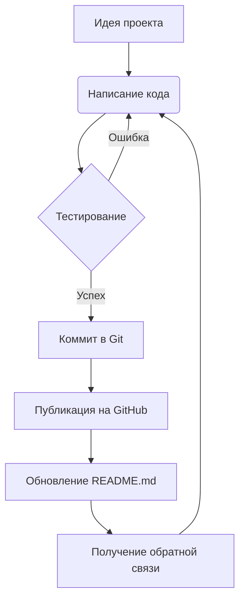

# 1512.2
## Secondo

---

## 📑 Навигация по проекту и документу

*   [🚀 **О проекте**](#о-проекте)
*   [📁 **Структура проекта**](#структура-проекта)
*   [💻 **Пример кода**](#пример-кода)
*   [📊 **Сравнение с аналогами**](#сравнение-с-аналогами)
*   [🔧 **Как работает проект?**](#как-работает-проект-диаграмма)
*   [✨ **Особенности**](#особенности)

---

## 🚀 О проекте

Этот проект — **не просто** строка кода. Это *культурный мост* и **образовательный инструмент**, который показывает, как одна простая идея может быть выражена сотней разных способов.

> "Программирование — это искусство рассказывать другому человеку, что ты хочешь, чтобы компьютер сделал." – *Donald Knuth*

Проект учит основам `Git`, `Markdown` и управлению проектами через **контроль версий**.

---

## 📁 Структура проекта

Вот все ключевые файлы нашего проекта:

1.  [src/README.md](src/README.md) — Исходные коды программы.
2.  [translations/README.md](translations/README.md) — Переводы приветствия на разные языки мира.
3.  [resources/README.md](resources/README.md) — Ресурсы проекта (иконки, диаграммы).

---

## 🖼️ Галерея


*Работа над проектом в самом разгаре*


*Красота в простоте*

---

## 💻 Пример кода

Вот как выглядит классическое приветствие на разных языках:

```python
# Python: Элегантно и просто
print("Hello, World!")

# Бонус: с использованием переменной
greeting = "Hello"
target = "World"
message = f"{greeting}, {target}!"
print(message)
```

```javascript
// JavaScript: Для веба и не только
console.log("Hello, World!");
// И даже в браузере!
alert("Hello, World!");
```

---

## 📊 Сравнение с аналогами

```mermaid
graph TD
    TITLE["<b>СРАВНЕНИЕ ПРОЕКТОВ</b>"] --> CRITERIA["<b>Критерий</b>"]
    TITLE --> OUR["<b>Наш проект</b>"]
    TITLE --> STD["<b>Стандартный</b>"]
    TITLE --> PRO["<b>Проф. шаблон</b>"]
    
    CRITERIA --> LANG["🌐 <b>Поддержка языков</b>"]
    LANG --> OUR_LANG["<b>50+</b>"]
    LANG --> STD_LANG["<b>1</b>"]
    LANG --> PRO_LANG["<b>10-20</b>"]
    
    CRITERIA --> DOCS["📚 <b>Документация</b>"]
    DOCS --> OUR_DOCS["<b>Полная (Markdown)</b>"]
    DOCS --> STD_DOCS["<b>❌ Отсутствует</b>"]
    DOCS --> PRO_DOCS["<b>Базовая</b>"]
    
    CRITERIA --> README["✨ <b>Красивое README</b>"]
    README --> OUR_README["<b>✅ Да, с диаграммами</b>"]
    README --> STD_README["<b>❌ Нет</b>"]
    README --> PRO_README["<b>⚠️ Иногда</b>"]
    
    CRITERIA --> EASY["🎯 <b>Для новичков</b>"]
    EASY --> OUR_EASY["<b>⭐⭐⭐⭐⭐</b>"]
    EASY --> STD_EASY["<b>⭐⭐⭐⭐⭐</b>"]
    EASY --> PRO_EASY["<b>⭐⭐</b>"]
    
    CRITERIA --> PORTFOLIO["💼 <b>Для портфолио</b>"]
    PORTFOLIO --> OUR_PORT["<b>✅ Идеально</b>"]
    PORTFOLIO --> STD_PORT["<b>❌ Слишком просто</b>"]
    PORTFOLIO --> PRO_PORT["<b>✅ Да</b>"]
    
    CRITERIA --> STRUCT["📁 <b>Структура</b>"]
    STRUCT --> OUR_STRUCT["<b>Полная (папки)</b>"]
    STRUCT --> STD_STRUCT["<b>Один файл</b>"]
    STRUCT --> PRO_STRUCT["<b>Базовая</b>"]
    
    CRITERIA --> CODE["💻 <b>Примеры кода</b>"]
    CODE --> OUR_CODE["<b>Много, с комментариями</b>"]
    CODE --> STD_CODE["<b>Один простой</b>"]
    CODE --> PRO_CODE["<b>Без объяснений</b>"]
    
    CRITERIA --> LICENSE["📜 <b>Лицензия</b>"]
    LICENSE --> OUR_LIC["<b>MIT (открытая)</b>"]
    LICENSE --> STD_LIC["<b>❌ Не указана</b>"]
    LICENSE --> PRO_LIC["<b>Часто MIT</b>"]
```



---

## 🔧 Как работает проект?


---

✨ Особенности


• 🌐 **Мультиязычность:** Приветствия со всего мира.

• 📚 **Образовательный фокус:** Каждый пример снабжен комментариями.

• 🎯 **Идеально для портфолио:** Демонстрирует навыки работы с Git, Markdown и структурирования проекта.

• 🔧 **Открытый код:** Любой может предложить новый язык или улучшение.

---
